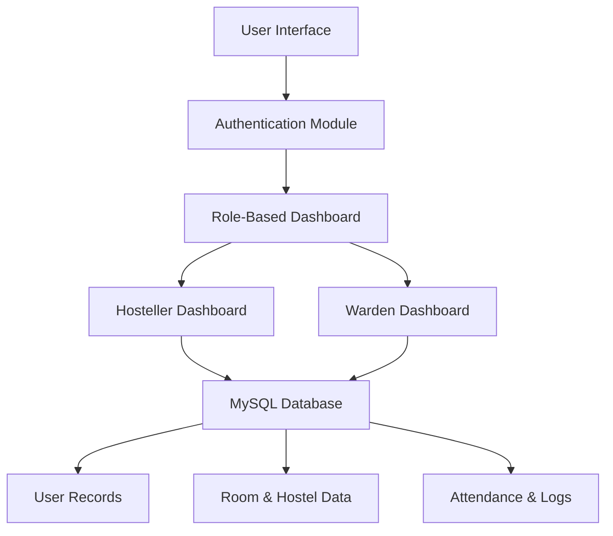

# 🏠 Hostel Management System

A role-based desktop application built using **Python (Tkinter)** and **MySQL**, designed to streamline student hostel operations like **attendance tracking**, **outpass requests**, and **user management** for both students and wardens.

---

## 📋 Project Overview

This project was developed as part of the **CGB1221 – Database Management Systems** course at **K. Ramakrishnan College of Technology (Autonomous), affiliated to Anna University Chennai)**.

- **Author**: GODFREY T R  
- **Supervisor**: Ms. S. Uma Mageshwari, M.E.  
- **Department**: Computer Science and Engineering  
- **Year**: 2024–2025

---

## 🎯 Objective

To design and implement a secure, user-friendly, and centralized platform for digitizing hostel management processes, reducing manual errors, and improving administrative efficiency.

---

## 🛠️ Technologies Used

| Layer      | Technology                 |
|------------|----------------------------|
| Frontend   | Python (`Tkinter` GUI)     |
| Backend    | MySQL                      |
| Library    | `mysql-connector-python`, `tkcalendar` |
| Platform   | Desktop Application        |

---

---
## 👥 User Roles & Features

### 👨‍🎓 Hosteller
- Mark attendance (P/A/L)
- Request outpass with reason and duration
- View personal information
- View attendance and outpass history

### 🧑‍💼 Warden
- View and approve/reject outpass requests
- Access filtered hosteller lists
- View monthly attendance summary
- Get birthday alerts for hostellers

---

## ⚙️ Setup Instructions

### 1. Clone the Repository

```bash
git clone https://github.com/yourusername/hostel-management-system.git
cd hostel-management-system
````

### 2. Install Dependencies

```bash
pip install mysql-connector-python tkcalendar
```

### 3. Configure the MySQL Database

Run the SQL script provided inside `database/schema.sql` (or copy from `Report.pdf`) to create necessary tables.

```sql
CREATE DATABASE gd_hms;
USE gd_hms;
-- Run all CREATE TABLE statements
```

### 4. Launch the App

```bash
python homepage.py
```

> ✅ Start with registration and login to access dashboards based on your role.

---

## 📁 Project Structure

```
📦 hostel-management-system/
├── homepage.py
├── login.py
├── register.py
├── hosteller_dashboard.py
├── warden_dashboard.py
├── database/
│   └── schema.sql
├── README.md
└── Report.pdf
```

---

## 🔐 Security Notes

* 🔒 Currently uses **plain-text passwords** — consider using `bcrypt` for hashing.
* ✅ Uses **parameterized queries** to prevent SQL injection.
* 🧠 Future enhancement includes **multi-factor authentication** and **QR code attendance**.

---

## 🚀 Future Enhancements (from Report)

* 📱 Mobile app version with push notifications
* 📈 Analytics and reporting for wardens
* 💳 Payment system integration
* 🔐 Enhanced security and encryption
* 🧠 AI-based facial recognition attendance

---

## 📸 Screenshots (see Report.pdf)

* Homepage
* Login and Register Page
* Hosteller Dashboard
* Warden Dashboard

---

## 📄 References

* [Tkinter Docs](https://tkdocs.com/)
* [MySQL Docs](https://www.mysql.com/)
* [Python.org](https://docs.python.org/3/)
* [DBMS Book](https://www.db-book.com/)

---

## 📜 License

This project is licensed under the **MIT License** – see the `LICENSE` file for details.

---

## 🙌 Acknowledgements
```
Special thanks to:

* Dr. A. Delphin Carolina Rani (Head of CSE Dept.)
* Ms. S. Uma Mageshwari (Project Supervisor)
* All faculty and lab assistants of KRCT
```
---

## 🌟 Author

Developed with curiosity and logic.

If you like this project, consider giving it a ⭐ on GitHub — it helps others discover it.

