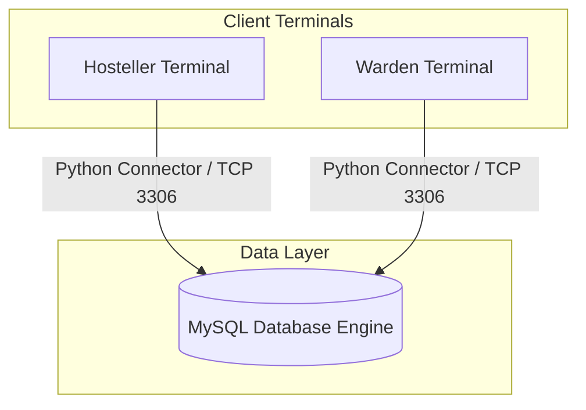
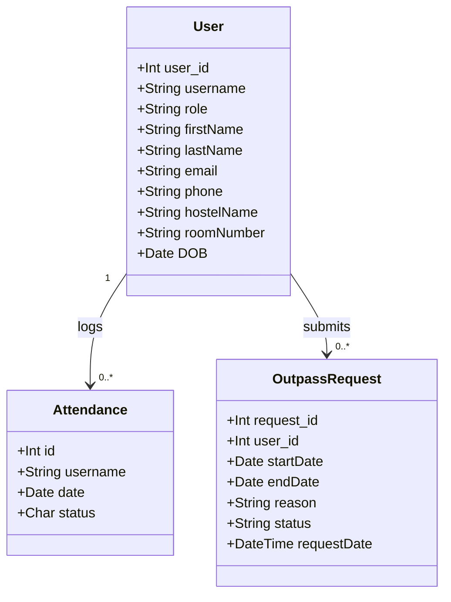
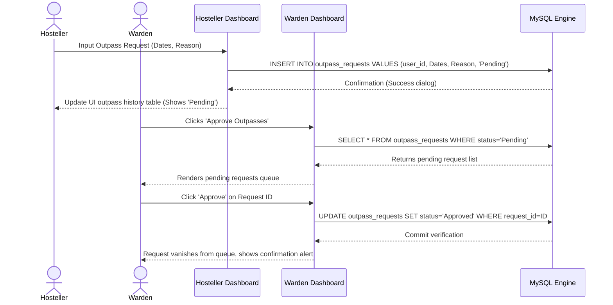
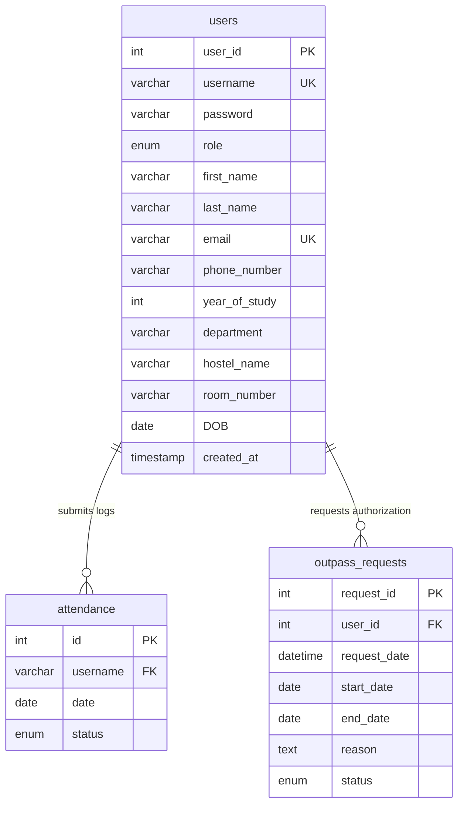

```
    __  __           __       __  ____  __                     
   / / / /___  _____/ /____  / /_/ ___// /_  ____  ________ ___
  / /_/ / __ \/ ___/ __/ _ \/ / /\___ \/ __ \/ __ \/ ___/ _ \/ _ \
 / __  / /_/ (__  ) /_/  __/ / /____/ / / / / /_/ / /  /  __/  __/
/_/ /_/\____/____/\__/\___/_/_//____/_/ /_/ .___/_/   \___/\___/ 
                                         /_/                     
   __  ___                                                 __ 
  /  |/  /___ _____  ____ _____ ____  ____ ___  ___  ____  / /_
 / /|_/ / __ `/ __ \/ __ `/ __ `/ _ \/ __ `__ \/ _ \/ __ \/ __/
/ /  / / /_/ / / / / /_/ / /_/ /  __/ / / / / /  __/ / / / /_  
/_/  /_/\__,_|_/ /_/\__,_/\__, /\___/_/ /_/ /_/\___/_/ /_/\__/  
                         /____/                                
```

[](https://www.python.org/)
[](https://www.mysql.com/)
[](https://docs.python.org/3/library/tkinter.html)
[](#interactive-web-presentation)
[](#the-developers-story)

---

## The Developers Story

### Project Inspiration
Hostel life is a vital phase of a student's academic journey. However, managing the operations of a hostel—tracking attendance, securing outpasses, handling user registries, and addressing birthday events—often relies on fragmented, paper-based workflows. The core inspiration behind **HostelSphere** was to eliminate logbooks and register sheets, replacing them with a secure and responsive system that bridges the gap between administrators (Wardens) and residents (Hostellers). By digitizing these manual workflows, we reduce logistical friction and administrative overhead.

### Meet the Team
This system was built, proposed and presented as an academic semester project submission in the year 2025:
*   **Author / Core Engineer**: GODFREY T R (Department of Computer Science & Engineering)
*   **Project Supervisor**: Ms. S. Uma Mageshwari, M.E.
*   **Affiliation**: K. Ramakrishnan College of Technology (Autonomous), affiliated to Anna University Chennai.

### The Challenge
Developing a system that handles security-critical operations (like approving permissions to leave campus) requires absolute role separation. The system had to be lightweight enough to run on standard office desktops (using native GUI technologies), yet robust enough to enforce referential constraints and manage concurrent logs. Designing a clean Tkinter-based desktop GUI while ensuring seamless database transactions became our primary challenge. We had to ensure that network packets sent to our MySQL instance were secure, optimized, and didn't result in deadlock states.

### Design Philosophy
Our software follows a modular design pattern:
1.  **Zero-Heavy Dependencies**: Avoid bloated runtimes by leveraging Python's standard `tkinter` package for native performance.
2.  **Strict Role Separation**: Clear operational boundaries between Hostellers and Wardens to ensure data protection.
3.  **Relational Database Normalization**: Structuring the database engine to guarantee integrity across logs and outpass states.

```
+-------------------------------------------------------------+
|                     HostelSphere Design                     |
|                                                             |
|   +-------------------+              +------------------+   |
|   |   Hosteller View  |              |   Warden View    |   |
|   | - Self-attendance |              | - Approvals      |   |
|   | - Outpass requests|              | - Student roster |   |
|   +---------+---------+              +--------+---------+   |
|             |                                 |             |
|             +----------------+----------------+             |
|                              |                              |
|                     +--------v--------+                     |
|                     | Database Engine |                     |
|                     | (MySQL Schema)  |                     |
|                     +-----------------+                     |
+-------------------------------------------------------------+
```

### Engineering Journey
The development process progressed through three key milestones:
*   **Database Schema Tuning**: Normalizing tables (`users`, `attendance`, `outpass_requests`) to model relations without structural redundancy.
*   **GUI Assembly**: Building desktop windows with responsive components using standard Tkinter grids and frame components.
*   **Interactive Simulation Webpage**: Developing a high-profile web presentation layout (`index.html`, `style.css`, `app.js`) enabling users to simulate the desktop application directly in a web environment.

### Security-First Thinking
To protect personal information, we established clear transactional gates. In the Python application layer, database queries are parameterized to block SQL injection attacks. The separation of Warden privileges prevents students from editing logs or approving their own outpasses.

### Building the Consent Workflow
The outpass request is designed as a direct transactional sequence:
1.  A student initiates a request by detailing dates and reasons.
2.  The request is committed to the database under a `Pending` state.
3.  The Warden's terminal pulls this record into a dedicated action queue.
4.  Once the Warden submits an approval or rejection, the record transitions state, updating the student's history logs.

```
Hosteller              MySQL Engine              Warden
   |                         |                      |
   |--[1] Submit Outpass---->|                      |
   |   (Status: Pending)     |                      |
   |                         |--[2] Load Pending--->|
   |                         |   Queue              |
   |                         |                      |
   |                         |<--[3] Approve/Reject-|
   |                         |   (State Committed)  |
   |<--[4] Refresh History---|                      |
```

### User Experience Decisions
To ensure ease of use, we designed a simple menu interface in Tkinter. Students can navigate the application via button boards, and the date selection relies on calendars. In our web simulation presentation, we implemented a glassmorphism dark aesthetic to showcase the layout.

### Technical Challenges & Solutions
*   **Handling Null Request Dates**: In early builds, outpass request timestamps occasionally defaulted to NULL. We resolved this in our SQL query using `IFNULL(request_date, NOW())` updates to guarantee timestamp tracking.
*   **Responsive Tkinter Geometry**: Standard window layouts could break on screens with different scale factors. We resolved this by organizing grids with weight-based row and column configurations.

### Collaboration Story
This project was built in an academic environment, allowing us to gather regular feedback from faculty and peers. Through iterative testing sessions, we refined the user validation checks and enhanced the reporting workflows.

### Lessons Learned
*   **Database Constraints Are Essential**: Relying solely on client-side logic to protect data is insufficient. Database-level constraints are necessary to prevent duplicate attendance logs.
*   **State Alignment**: Designing complex client interfaces requires a unified state manager. This lesson guided the development of our web-based interactive simulator.

### Future Vision
In future releases, we plan to implement:
*   **Password Encryption**: Upgrading authentication using bcrypt hashing.
*   **Biometric Syncing**: Integrating card readers or fingerprint scanners for automated check-ins.
*   **Mobile Dashboards**: Creating native Android/iOS viewports linked to the central SQL cluster.

### Behind the Name
The name **HostelSphere** reflects our vision of a complete, all-in-one ecosystem that manages every aspect of hostel logistics.

### Message from the Developers
> *"HostelSphere represents our commitment to designing systems that simplify daily administration. We hope this database schema and codebase serves as a solid foundation for your campus administration needs."*

---

## Table of Contents
1. [Developer Story](#the-developers-story)
2. [System Architecture](#system-architecture)
3. [Core Capabilities & Features](#core-capabilities--features)
4. [Database Design & Schema](#database-design--schema)
5. [File Anatomy & Directory Mapping](#file-anatomy--directory-mapping)
6. [Desktop GUI Application Walkthrough](#desktop-gui-application-walkthrough)
7. [API & Code Reference](#api--code-reference)
8. [Local Deployment Guide](#local-deployment-guide)
9. [Interactive Web Presentation](#interactive-web-presentation)
10. [Software Testing Matrix](#software-testing-matrix)
11. [Troubleshooting & FAQs](#troubleshooting--faqs)
12. [Security, Privacy & Hardening](#security-privacy--hardening)
13. [Scalability Roadmap](#scalability-roadmap)
14. [Licensing](#licensing)

---

## System Architecture

HostelSphere operates on a local client-server topology. The desktop application directly connects to a MySQL database using standard network sockets.

### System Topology


### Component Structure


### Execution Flow Sequence
The sequence diagram below displays the transaction cycle when a student requests an outpass and the warden approves it.



---

## Core Capabilities & Features

HostelSphere provides administrative control for wardens and utility management for hostellers.

```
HostelSphere Feature Overview
├─ 🔐 Role-Based Access Control (Authentication separation)
├─ 📅 Attendance Audits (Log history tables)
├─ 📤 Outpass Workflows (Dynamic submissions, live decision controls)
├─ 🎂 Birthday Alert System (Automatic daily scans)
├─ 🔍 Smart Directory Filtering (Dynamic query modifications)
└─ 🎨 Switches Dark & Light themes (Interactive display configurations)
```

---

## Database Design & Schema

The system uses a structured relational model to manage database updates. The schema is defined in [gd_hms.sql.txt](file:///e:/GitHub-Repos/HostelSphere-Management/gd_hms.sql.txt).

### Database Schema Entity Relationships
Below is a relational representation of the tables showing how database integrity is maintained.



### Table Structure Mappings

#### 1. Table: `users`
Stores all account details, credentials, and structural profiles for students and wardens.

| Field Name | Data Type | Key Type | Nullable | Default | Description / Rules |
| :--- | :--- | :--- | :--- | :--- | :--- |
| `user_id` | `INT(11)` | `PRIMARY` | `NO` | `NULL` | Unique auto-incrementing identifier. |
| `username` | `VARCHAR(50)` | `UNIQUE` | `NO` | `NULL` | User identifier used for authentication. |
| `password` | `VARCHAR(255)` | `NONE` | `NO` | `NULL` | Authentication credentials. |
| `role` | `ENUM('warden', 'hosteller')` | `NONE` | `NO` | `NULL` | Sets dashboard permissions. |
| `first_name` | `VARCHAR(50)` | `NONE` | `NO` | `NULL` | First name. |
| `last_name` | `VARCHAR(50)` | `NONE` | `YES` | `NULL` | Last name. |
| `email` | `VARCHAR(100)` | `UNIQUE` | `NO` | `NULL` | Contact email. |
| `phone_number` | `VARCHAR(15)` | `NONE` | `YES` | `NULL` | Contact phone number. |
| `year_of_study`| `INT(11)` | `NONE` | `YES` | `NULL` | Current academic year. |
| `department` | `VARCHAR(100)` | `NONE` | `YES` | `NULL` | Academic division. |
| `hostel_name` | `VARCHAR(50)` | `NONE` | `YES` | `NULL` | Hostel block. |
| `room_number` | `VARCHAR(10)` | `NONE` | `YES` | `NULL` | Assigned room. |
| `DOB` | `DATE` | `NONE` | `YES` | `NULL` | Date of birth for birthday alerts. |
| `created_at` | `TIMESTAMP` | `NONE` | `NO` | `CURRENT_TIMESTAMP`| Creation timestamp. |

```sql
CREATE TABLE users (
    user_id INT(11) NOT NULL AUTO_INCREMENT,
    username VARCHAR(50) NOT NULL UNIQUE,
    password VARCHAR(255) NOT NULL,
    role ENUM('warden', 'hosteller') NOT NULL,
    first_name VARCHAR(50) NOT NULL,
    last_name VARCHAR(50) DEFAULT NULL,
    email VARCHAR(100) NOT NULL UNIQUE,
    phone_number VARCHAR(15) DEFAULT NULL,
    year_of_study INT(11) DEFAULT NULL,
    department VARCHAR(100) DEFAULT NULL,
    hostel_name VARCHAR(50) DEFAULT NULL,
    room_number VARCHAR(10) DEFAULT NULL,
    DOB DATE DEFAULT NULL,
    created_at TIMESTAMP DEFAULT CURRENT_TIMESTAMP,
    PRIMARY KEY (user_id)
);
```

#### 2. Table: `attendance`
Tracks daily attendance logs for students.

| Field Name | Data Type | Key Type | Nullable | Default | Description / Rules |
| :--- | :--- | :--- | :--- | :--- | :--- |
| `id` | `INT(11)` | `PRIMARY` | `NO` | `NULL` | Auto-incrementing identifier. |
| `username` | `VARCHAR(50)` | `INDEX` | `NO` | `NULL` | Mapped to `users.username`. |
| `date` | `DATE` | `NONE` | `NO` | `NULL` | Log date. |
| `status` | `ENUM('P', 'A', 'L')` | `NONE` | `NO` | `NULL` | `P` = Present, `A` = Absent, `L` = Leave. |

```sql
CREATE TABLE attendance (
    id INT(11) NOT NULL AUTO_INCREMENT,
    username VARCHAR(50) NOT NULL,
    date DATE NOT NULL,
    status ENUM('P', 'A', 'L') NOT NULL,
    PRIMARY KEY (id),
    INDEX (username)
);
```

#### 3. Table: `outpass_requests`
Manages outpass requests and approvals.

| Field Name | Data Type | Key Type | Nullable | Default | Description / Rules |
| :--- | :--- | :--- | :--- | :--- | :--- |
| `request_id` | `INT(11)` | `PRIMARY` | `NO` | `NULL` | Auto-incrementing identifier. |
| `user_id` | `INT(11)` | `INDEX` | `YES` | `NULL` | Foreign key referencing `users.user_id`. |
| `request_date` | `DATETIME` | `NONE` | `YES` | `CURRENT_TIMESTAMP` | Request timestamp. |
| `start_date` | `DATE` | `NONE` | `YES` | `NULL` | Leave start date. |
| `end_date` | `DATE` | `NONE` | `YES` | `NULL` | Return date. |
| `reason` | `TEXT` | `NONE` | `YES` | `NULL` | Student justification. |
| `status` | `ENUM('Pending', 'Approved', 'Rejected')` | `NONE` | `YES` | `'Pending'` | Request state. |

```sql
CREATE TABLE outpass_requests (
    request_id INT(11) NOT NULL AUTO_INCREMENT,
    user_id INT(11) DEFAULT NULL,
    request_date DATETIME DEFAULT CURRENT_TIMESTAMP,
    start_date DATE DEFAULT NULL,
    end_date DATE DEFAULT NULL,
    reason TEXT DEFAULT NULL,
    status ENUM('Pending', 'Approved', 'Rejected') DEFAULT 'Pending',
    PRIMARY KEY (request_id),
    INDEX (user_id)
);
```

---

## File Anatomy & Directory Mapping

The structure of the codebase is outlined below:

```
📦 HostelSphere-Management/
├── homepage.py              # Main application landing page (Tkinter UI)
├── login.py                 # Core authentication portal (handles roles)
├── register.py              # Extended user registration workflow
├── hosteller_dashboard.py   # Student workspace (Attendance/Outpass logs)
├── warden_dashboard.py      # Warden dashboard (Approvals/Roster/Filters)
├── db_helper.py             # Centralized database connection utility
├── gui_helper.py            # Centralized GUI styling and theming utility
├── gd_hms.sql.txt           # Raw MySQL schema definitions
│
├── index.html               # Interactive web simulator (System Showcase)
├── style.css                # Visual presentation styling
├── app.js                   # Client-side simulation script
├── hero.png                 # Promotional banner asset
├── LOGO .png                # Project logo asset
│
├── Presentation.pptx        # Academic presentation slides
└── Report.pdf               # Complete academic project documentation
```

---

## Desktop GUI Application Walkthrough

### 1. Entrance (`homepage.py`)
This file is the main entry point for the desktop client, providing a simple navigation panel.

```python
# Launch structure inside homepage.py
def show_homepage():
    root = tk.Tk()
    root.title("🏠 Hostel Management System")
    root.geometry("800x600")
    root.config(bg="#e6f2ff")
    
    # Navbar Construction
    navbar = tk.Frame(root, bg="#ccddff", pady=10)
    navbar.pack(fill='x')
    
    # Navigation items, Features, & Copyright bindings...
    root.mainloop()
```
*   **Key Modules**: Links to system features and switches viewports to the login window.
*   **UI Layout**: Standard blue styling with quick action buttons.

### 2. Authorization Hub (`login.py`)
Directs users to their respective dashboards based on their role after validating credentials against the database. It handles database queries to verify user access profiles.

*   **Role Identification Logic**:
    ```python
    def login_user(username, password, win):
        cursor.execute("SELECT user_id, role FROM users WHERE username=%s AND password=%s", (username, password))
        result = cursor.fetchone()
        if result:
            user_id, role = result
            win.destroy()
            if role == "warden":
                open_warden_dashboard(username)
            elif role == "hosteller":
                open_hosteller_dashboard(username)
        else:
            messagebox.showerror("❌ Login Failed", "Invalid credentials.")
    ```

### 3. Student Registration (`register.py`)
Provides the interface for new students to register and enter their profile details.

*   **Field Constraints**:
    *   Authentication: `Username` (must be unique), `Password`
    *   Identity: `First Name`, `Last Name`, `DOB` (integrated calendar picker)
    *   Contact: `Email` (must be unique format), `Phone Number`
    *   Academic: `Department`, `Year of Study` (1st, 2nd, 3rd, 4th)
    *   Allocation: `Hostel Block` (A, B, C), `Room Number`

### 4. Student Workspace (`hosteller_dashboard.py`)
Enables students to manage their records, view profiles, log attendance, and request outpasses.

*   **Calendar Integration**: Relies on the `tkcalendar.Calendar` widget to pick specific days, showing status indicators color-coded by performance log entries (Green = Present, Red = Absent, Yellow = Leave).
*   **Dynamic Outpass Insertion**: Validates that the return date is not prior to the start date before executing database insertions.

### 5. Warden Dashboard Portal (`warden_dashboard.py`)
Provides wardens with administrative controls to manage hostel operations.

```
Warden View Components
├─ [View Attendance]: Queries historical logs table using join variables.
├─ [Approve Outpasses]: Displays pending outpass requests.
├─ [View Hostellers]: Displays the student roster.
├─ [Attendance Overview]: Calculates presence percentages for the current month.
├─ [Birthday Alerts]: Scans profiles for students celebrating birthdays.
└─ [Filter Hostellers]: Combobox filters to search the registry.
```

---

## API & Code Reference

Below is the function reference for the dashboard modules.

### Hosteller Core Logic: `hosteller_dashboard.py`

#### `view_hosteller_info(username)`
Queries user records to display the profile card.
*   **Parameters**: `username` (string)
*   **Database Operation**:
    ```sql
    SELECT first_name, last_name, email, phone_number, year_of_study, department, hostel_name, room_number 
    FROM users WHERE username = ? AND role = 'hosteller';
    ```

#### `manage_attendance(username)`
Launches an interactive calendar enabling students to log attendance.
*   **Parameters**: `username` (string)
*   **Database Operation**:
    ```sql
    INSERT INTO attendance (username, date, status) VALUES (?, ?, ?)
    ON DUPLICATE KEY UPDATE status = VALUES(status);
    ```

#### `request_outpass(username)`
Submits outpass requests after performing date validations.
*   **Parameters**: `username` (string)
*   **Validations**: Checks that `start_date` is less than or equal to `end_date`, and that the `reason` is not empty.

---

### Warden Core Logic: `warden_dashboard.py`

#### `view_attendance()`
Queries attendance records for all students.
*   **Database Operation**:
    ```sql
    SELECT u.username, u.first_name, u.last_name, a.date, a.status
    FROM attendance a JOIN users u ON a.username = u.username
    ORDER BY a.date DESC;
    ```

#### `approve_outpass()`
Displays pending outpasses, providing options to approve or reject requests.
*   **Database Operation**:
    ```sql
    SELECT o.request_id, u.first_name, u.last_name, o.request_date, o.start_date, o.end_date, o.reason
    FROM outpass_requests o JOIN users u ON o.user_id = u.user_id
    WHERE o.status = 'Pending';
    ```

#### `update_outpass_status(outpass_id, status, window)`
Updates the status of an outpass request.
*   **Parameters**: `outpass_id` (int), `status` (string), `window` (Tkinter GUI element)
*   **Database Operation**:
    ```sql
    UPDATE outpass_requests SET status = ?, request_date = IFNULL(request_date, NOW()) WHERE request_id = ?;
    ```

#### `view_attendance_summary()`
Calculates attendance statistics for the current month.
*   **Database Operation**:
    ```sql
    SELECT u.first_name, u.last_name, a.status
    FROM attendance a JOIN users u ON a.username = u.username
    WHERE MONTH(a.date) = MONTH(NOW()) AND YEAR(a.date) = YEAR(NOW());
    ```

#### `show_birthday_alerts()`
Checks for students celebrating their birthday on the current date.
*   **Database Operation**:
    ```sql
    SELECT first_name, last_name, email FROM users
    WHERE DATE_FORMAT(DOB, '%m-%d') = DATE_FORMAT(NOW(), '%m-%d');
    ```

---

## Local Deployment Guide

Follow these steps to run the application locally on a workstation.

### Prerequisites
*   **Python**: Version 3.8 or higher.
*   **MySQL Server**: Version 8.0 or higher.

### Step 1: Install Dependencies
Install the required packages using pip:
```bash
pip install mysql-connector-python tkcalendar
```

### Step 2: Set Up Database Engine
1.  Log in to your local MySQL terminal:
    ```bash
    mysql -u root -p
    ```
2.  Run the database script:
    ```sql
    CREATE DATABASE gd_hms;
    USE gd_hms;
    -- Import definitions from gd_hms.sql.txt
    ```

### Step 3: Run the Desktop Client
Start the application from the project root:
```bash
python homepage.py
```

---

## Interactive Web Presentation

To demonstrate how the system works without requiring a local database connection, we built an interactive simulator in HTML, CSS, and JS.

```
+------------------------------------------------------------+
|                       index.html                           |
|                                                            |
|   +----------------------------------------------------+   |
|   |                  Window Titlebar                   |   |
|   +----------------------------------------------------+   |
|   |  [Role Selection]  |        Dashboard Content       |   |
|   |                    |                                |   |
|   |  - Student View    |   - Interactive Calendar       |   |
|   |  - Warden View     |   - Outpass Forms              |   |
|   |                    |   - Live Roster Filters        |   |
|   +--------------------+--------------------------------+   |
|                                                            |
|   ======================================================   |
|   Semester Project Notice: This page is for showcase.      |
+------------------------------------------------------------+
```

### Features of the Web Simulator
*   **Role Selection**: Switch between Hosteller and Warden views to simulate user permissions.
*   **Interactive Calendar**: Click dates in the simulator to mark mock attendance.
*   **Outpass Workflow Simulation**: Submit outpass requests in Student View and approve them in Warden View.
*   **Roster Filtering**: Filter student tables in real-time.

### Running the Web Simulator
Simply open the HTML file in any modern web browser:
```bash
# Double click index.html or open via command terminal
start index.html
```

---

## Software Testing Matrix

Below is our verification matrix for validating the system features.

| TC ID | Area | Action | Expected Behavior | Status |
| :--- | :--- | :--- | :--- | :--- |
| `TC-AUTH-01` | Auth | Incorrect password entry. | Displays login failure popup message. | Passed |
| `TC-AUTH-02` | Auth | Correct warden login credentials. | Opens Warden Admin dashboard portal. | Passed |
| `TC-ATT-01` | Attendance | Student selects date & marks "Leave".| Database registers "L" status. | Passed |
| `TC-OUT-01` | Outpass | Submit request with end date prior to start date. | Rejects request and prompts error popup. | Passed |
| `TC-OUT-02` | Outpass | Warden approves pending outpass. | Outpass status changes to "Approved". | Passed |
| `TC-FLT-01` | Filters | Select "Hostel A" + "Computer Science".| Table updates to display matching records. | Passed |
| `TC-BDAY-01` | Alerts | Query date matches student DOB. | Displays student on the birthday alert list. | Passed |

---

## Troubleshooting & FAQs

### Troubleshooting Guide

#### 1. Database Connection Failures
*   **Error**: `mysql.connector.errors.InterfaceError: 2003: Can't connect to MySQL server on 'localhost'`
*   **Solution**: Ensure your MySQL local service is active:
    ```bash
    # Windows Command Prompt (Admin)
    net start wampmysql64  # or net start mysql
    ```
    Verify that host, username, and password parameters match in `homepage.py` and connected scripts.

#### 2. Missing Calendars
*   **Error**: `ModuleNotFoundError: No module named 'tkcalendar'`
*   **Solution**: Install the package via pip:
    ```bash
    pip install tkcalendar
    ```

### Frequently Asked Questions (FAQs)

#### Can students approve their own outpass requests?
No. The system enforces role separation. Outpass status changes can only be written by users with the `warden` role.

#### How do we modify database credentials?
Database connection parameters are defined at the top of each backend file. Update the connection arguments to match your environment:
```python
db = mysql.connector.connect(
    host="localhost",
    user="YOUR_USER",
    password="YOUR_PASSWORD",
    database="gd_hms"
)
```

---

## Security, Privacy & Hardening

To protect personal information and ensure system security, we implemented several security controls:

### 1. Parameterized SQL Queries
To prevent SQL injection vulnerabilities, all SQL operations utilize parameterized input bindings:
```python
# Secure implementation
cursor.execute("SELECT * FROM users WHERE username = %s AND password = %s", (username, password))
```

### 2. Privileged Authorization Gates
System features are restricted based on user roles. The Python application layer verifies permissions on the server before executing administrative tasks, such as modifying rosters or approving outpasses.

---

## Scalability Roadmap

To prepare the application for higher concurrent loads, we have planned several structural updates:

```
Scalability Roadmap Timeline
├── Phase 1: Implement password hashing using bcrypt.
├── Phase 2: Add connection pooling to manage concurrent queries.
├── Phase 3: Transition to a web-based REST API backend using FastAPI.
└── Phase 4: Deploy the application across a load-balanced cloud infrastructure.
```

---

## Licensing

This repository is licensed under the **MIT License**.

```
MIT License

Copyright (c) 2025 GODFREY T R

Permission is hereby granted, free of charge, to any person obtaining a copy
of this software and associated documentation files (the "Software"), to deal
in the Software without restriction, including without limitation the rights
to use, copy, modify, merge, publish, distribute, sublicense, and/or sell
copies of the Software, and to permit persons to whom the Software is
furnished to do so, subject to the following conditions:

The above copyright notice and this permission notice shall be included in all
copies or substantial portions of the Software.

THE SOFTWARE IS PROVIDED "AS IS", WITHOUT WARRANTY OF ANY KIND, EXPRESS OR
IMPLIED, INCLUDING BUT NOT LIMITED TO THE WARRANTIES OF MERCHANTABILITY,
FITNESS FOR A PARTICULAR PURPOSE AND NONINFRINGEMENT. IN NO EVENT SHALL THE
AUTHORS OR COPYRIGHT HOLDERS BE LIABLE FOR ANY CLAIM, DAMAGES OR OTHER
LIABILITY, WHETHER IN AN ACTION OF CONTRACT, TORT OR OTHERWISE, ARISING FROM,
OUT OF OR IN CONNECTION WITH THE SOFTWARE OR THE USE OR OTHER DEALINGS IN THE
SOFTWARE.
```
